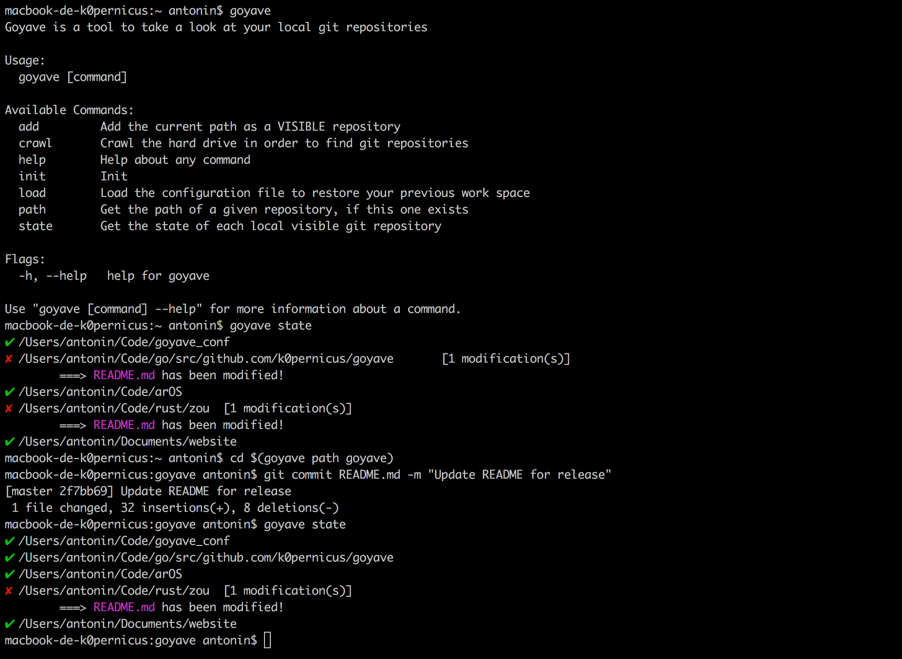

# goyave
A supervisor for git projects

_Goyave_ is a simple command-line tool to interact (**read only**) with your local git repositories, just in order to keep an eye on them.  
This tool creates and updates a TOML file (in your `$HOME` directory), to speed-up interactions and to perform back-ups if you need.

## Visible / Hidden ?

_Goyave_ allows you to get some informations about _dirty_ git repositories in your system (a _dirty_ repository is a repository that contains non-commited files, modified files, etc...), via the `state` command.   
In order to get updates on repositories you are interested in, _Goyave_ uses a binary system:
* repositories you are interested in are considered as **VISIBLE**,
* repositories you want to ignore are considered as **HIDDEN**.

You can modify the default behaviour of _Goyave_ in your configuration file.

## Commands

* `goyave init` -> Command to create an empty configuration file if this one does not exists on your system  
* `goyave add` -> Command to add the current directory in the local configuration file  
* `goyave crawl` -> Command to crawl your hard drive to find git repositories - those repositories will be classified as **VISIBLE** or **HIDDEN** according to the local system configuration  
* `goyave load` -> Command to load an existing configuration file, to retrieve a previous system (for example, to retrieve a work system after an hard reboot)  
* `goyave path` -> Command to get the path of a local git repository (useful if your repositories are spread in your file system)
* `goyave state` -> Command to get the current state of your **VISIBLE** git repositories

## The configuration file

The configuration file is available at `$HOME/.goyave`.  
You can find, for example, my goyave configuration file [here](https://github.com/k0pernicus/goyave_conf).

## Screenshot

## How to use it?

#### If you are using goyave the first time

1.  `go get github.com/k0pernicus/goyave`
2. *Optional*: The default behavior of _Goyave_ is set to **VISIBLE** - you can change it before crawling your hard drive
3. `goyave crawl` (recommended!)
4. `goyave state`

#### If you are using goyave using an existing configuration file, on the same machine

1. `go get github.com/k0pernicus/goyave`
2. `mv my_configuration_file ~/.goyave`
3. `goyave load`

## Contributing

_Goyave_ is my first Go project, and I still nead to learn **a lot** ;-)  
If you find bugs, want to improve the code and/or documentation, or add new features, please to create an issue and the associated pull request if you modified anything! :-)

If you want to create a pull request, this is the procedure to make it great:

* create an issue to explain the problem you encountered (except for typo),
* fork the project,
* create a local branch to make changes (from the `devel` branch),
* test your changes,
* create a pull request (please compare it with the `devel` branch),
* explain your changes,
* submit !

Thank you for your interest in contributing to _Goyave_ ! :-D

## Troubleshootings

* `goyave` supports only `libgit2 v0.26`. In order to get this version, please to make those steps:
    *   `go get -d github.com/libgit2/git2go # download the code`
    *   `cd $GOPATH/src/github.com/libgit2/git2go`
    *   `git submodule update --init # init submodules`
    *   `make install # install the current version of libgit2 and git2go on your file system`
    *   `cd $GOPATH/src/github.com/k0pernicus/goyave`
    *   `go install # install goyave`

## LICENSE

MIT License
